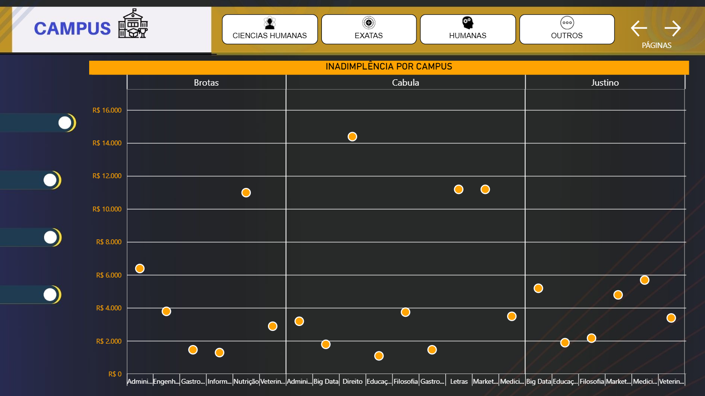
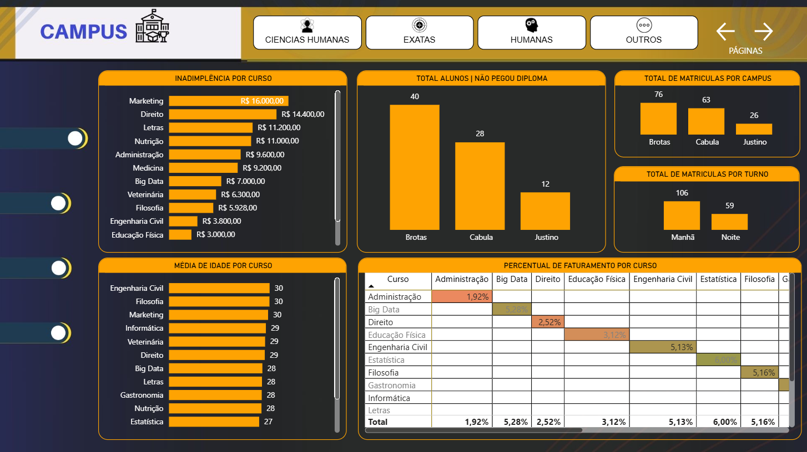
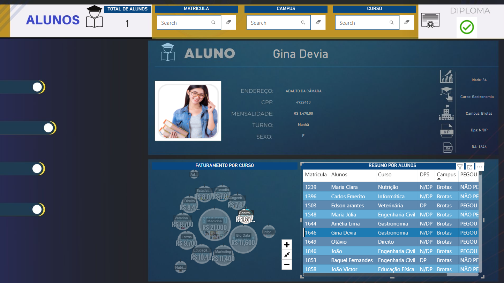
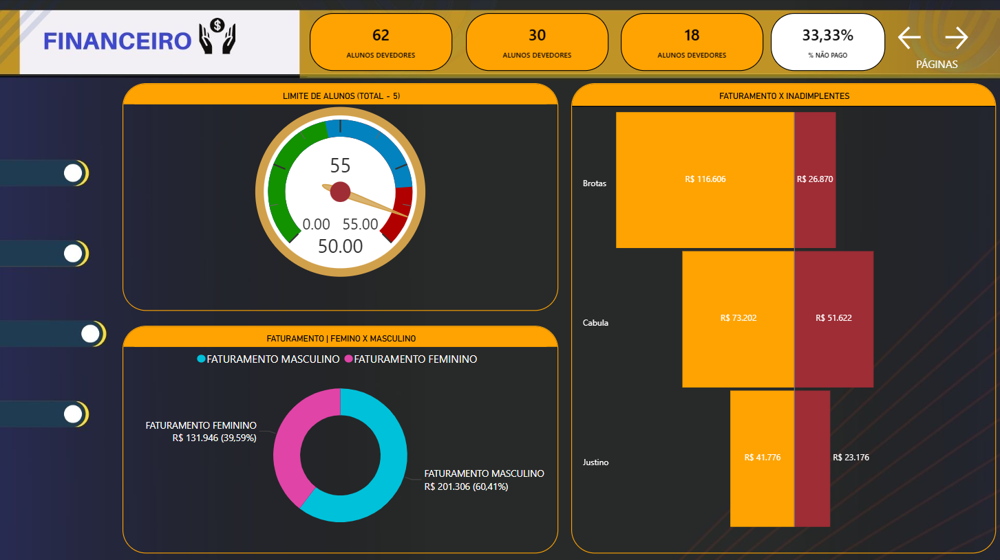
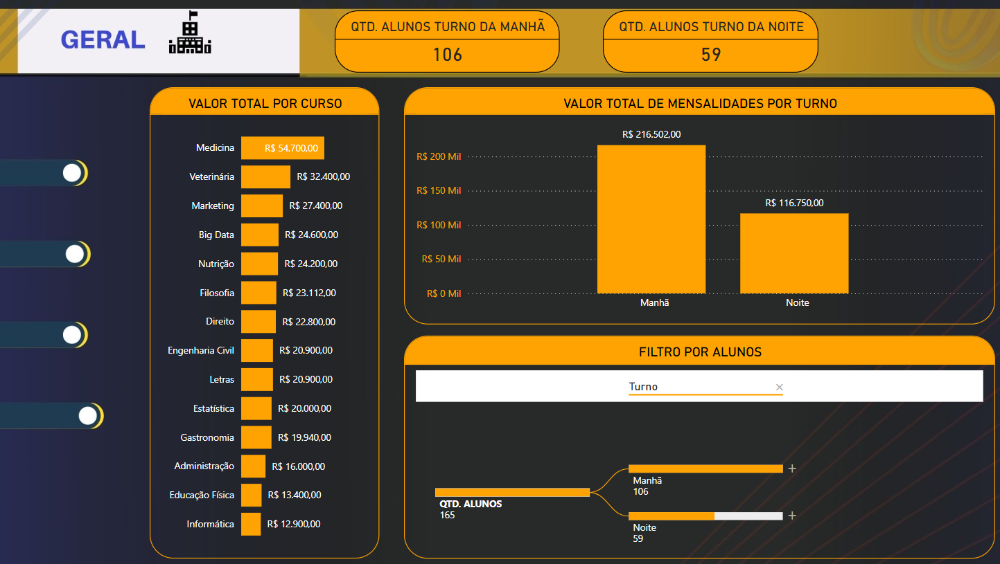

# 🎓 PROJETO POWER BI - UNIVERSIDADE YTO NIHON

Repositório de estudos feito na aula do professor Danilo Macial na plataforma da YTO NIHON, dedicado ao desenvolvimento de um dashboard analítico no Power BI, com foco na gestão de dados acadêmicos de uma universidade fictícia. 

---

## 📊 Descrição do Projeto

O projeto tem como objetivo central a criação de um painel interativo que permite visualizar e analisar dados relacionados à universidade, tais como:

- Faturamento
- Desempenho Acadêmico
- Taxa de Conclusão
- Distribuição de Cursos
- Perfil dos Alunos

---

## 🚀 Funcionalidades

- 📈 Análise de desempenho por curso e período.
- 🧑‍ Acompanhamento de alunos ativos, devedores e formados.
- 🔍 Filtros dinâmicos por curso, semestre, turno e outros critérios.
- 📅 Análises de faturamento.

  ---

## 🖼️ Imagens do Dashboard

